<div align="center">

# 🏗️ gcp-hcp-terraform

### A Governed, Multi-Environment GCP Pipeline · HCP Terraform · GitHub Actions · OPA · Google Cloud

[](https://github.com/bikram-singh/gcp-hcp-terraform/actions/workflows/pre-flight.yml)
[](https://app.terraform.io/app/gcpcloudhub)
[](https://www.terraform.io)
[](https://cloud.google.com)
[](https://www.openpolicyagent.org/)
[](https://app.terraform.io/app/gcpcloudhub/registry)
[-4285F4?logo=google&logoColor=white)](#-sso--google-workspace--hcp-terraform)
[](LICENSE)

---

*A real, live GCP infrastructure pipeline built on HCP Terraform: dev/prod environments with gated promotion, three published private-registry modules, OPA policy-as-code, a self-built Run Task, a Run Trigger chain provisioning real Cloud Monitoring resources, a self-hosted Agent, and SAML SSO — every capability demonstrated with real `plan`/`apply` output against live GCP projects, not just described.*

</div>

---

## 📋 Table of Contents

- [Overview](#-overview)
- [Architecture](#-architecture)
- [What's Deployed](#-whats-deployed)
- [Repository Structure](#-repository-structure)
- [Private Module Registry](#-private-module-registry)
- [Multi-Environment Pipeline](#-multi-environment-pipeline)
- [Policy as Code](#-policy-as-code-opa)
- [CI/CD Governance](#-cicd-governance)
- [All Three HCP Terraform Workflow Types](#-all-three-hcp-terraform-workflow-types)
- [Run Task — Custom Change-Freeze Guardrail](#-run-task--custom-change-freeze-guardrail)
- [Run Trigger + Real Monitoring](#-run-trigger--real-monitoring)
- [Self-Hosted Agent](#-self-hosted-agent)
- [SSO — Google Workspace ↔ HCP Terraform](#-sso--google-workspace--hcp-terraform)
- [Real Incidents Found & Fixed](#-real-incidents-found--fixed)
- [Setup](#-setup)
- [Repository](#-repository)

---

## 🌐 Overview

This repository provisions a GCP VPC, a CMEK-encrypted Artifact Registry, and a Cloud Run service — identically, in **dev** and **prod** — through HCP Terraform. That description alone undersells it: the actual point of this project was to build and prove out, end to end, essentially every capability HCP Terraform's Free tier offers, not just describe it.

### 🔑 Key Facts

| Property | Value |
|---|---|
| ☁️ **Cloud Platform** | Google Cloud Platform (`gcpcloudhub.in` org) |
| 🏗️ **IaC Engine** | HCP Terraform, real `plan`/`apply`/`destroy` |
| 🌎 **Environments** | `dev` (public, auto-apply) · `prod` (locked down, manual-confirm) |
| 🧩 **Published Modules** | 3, all consumed live by both environments |
| 🛡️ **Policy Engine** | OPA — 1 mandatory, 1 advisory policy |
| 🔐 **Auth** | Workload Identity Federation (OIDC) — no static service-account keys anywhere |
| ✅ **CI Checks** | fmt · validate · lock-file · tflint · Checkov · gitleaks |
| 🔑 **SSO** | SAML, Google Workspace as IdP |
| 🤖 **Custom Run Task** | Self-hosted Cloud Run webhook, HMAC-verified |
| 🖥️ **Self-Hosted Agent** | Docker-run `tfc-agent`, proven executing real plans |

### ✨ What Makes This Different

| Capability | Description |
|---|---|
| 🔁 **Zero-downtime module migration** | All 3 modules were carved out of a live, already-deployed root config using `moved` blocks — verified `0 create / 0 destroy` in both dev and prod on every migration |
| 🚦 **Real dev→prod gating** | Dev auto-applies on merge; prod requires manual confirmation and passes through a mandatory OPA policy that hard-blocks non-compliant plans |
| 🧵 **All three HCP Terraform workflow types, proven** | VCS-driven (the whole pipeline), CLI-driven (local `terraform apply`/`destroy`), and API-driven (raw REST calls, full CRUD) — each with a genuine create-to-destroy resource lifecycle, not just a screenshot |
| 🕵️ **Real incidents, not staged ones** | An uptime check built as a Run Trigger demo caught a real, unnoticed misconfiguration — dev's Cloud Run had required auth since day one. See [Real Incidents](#-real-incidents-found--fixed). |

### ❓ Why HCP Terraform?

HCP Terraform (formerly Terraform Cloud) is HashiCorp's managed control plane for Terraform — it runs your `plan`/`apply` in a consistent remote environment, stores state securely, and layers governance on top of raw Terraform. Concretely, on this project it provided:

| Benefit | How It Showed Up Here |
|---|---|
| **Managed remote execution** | No self-hosted state backend, no manual locking — every `gcphub-*` workspace runs its plans/applies on HCP Terraform's own infrastructure (or a self-hosted Agent, see below) |
| **Secure state management** | State is versioned, locked during runs, and never touched by hand — every module migration in this repo used `moved` blocks precisely *because* state integrity mattered |
| **Governance & policy** | OPA policy sets blocked or flagged non-compliant plans automatically — not a manual review step |
| **Centralized variable management** | WIF credentials and shared config live in Variable Sets and workspace variables, not scattered `.tfvars` files or hardcoded secrets |
| **A private module registry** | Three modules published and consumed live by both environments — see [Private Module Registry](#-private-module-registry) |

### Workflow Types HCP Terraform Supports

HCP Terraform organizes infrastructure by **workspaces**, and every workspace uses exactly one of three workflow types. This project deliberately built one real, dedicated workspace per type — not just one workflow with the others described in passing:

| Workflow | What It Means | Workspace Here |
|---|---|---|
| **VCS-driven** | A connected Git repo triggers plans/applies automatically on push or PR | `gcphub-dev`, `gcphub-prod`, `gcphub-dev-monitoring` |
| **CLI-driven** | You run `terraform init`/`plan`/`apply` locally; HCP Terraform executes remotely and streams the output back to your terminal | `gcphub-cli-demo` |
| **API-driven** | A custom script or tool drives runs entirely through HCP Terraform's REST API — no VCS, no local `terraform` binary required | `gcphub-api-demo` |

Full detail and real evidence for each is in [All Three HCP Terraform Workflow Types](#-all-three-hcp-terraform-workflow-types) below.

---

## 🏛️ Architecture

```
Commit → PR → GitHub Actions (fmt · validate · lock-file · tflint · Checkov · gitleaks)
        → merge to dev  → HCP Terraform: plan → OPA (advisory) → Run Task → auto-apply
        → PR dev → main → same checks      → merge to main
        → HCP Terraform: plan → OPA (mandatory) → Run Task → cost estimate
        → held for manual confirm → apply → prod live
```

```
                 ┌─────────────────────────────────────────┐
                 │        gcp-hcp-terraform (this repo)     │
                 │                                           │
                 │   infra/           → dev + prod root      │
                 │   monitoring/      → uptime check + alert │
                 │   tooling/         → API-driven script    │
                 │   policy/          → OPA reference copies │
                 └─────────────────────┬─────────────────────┘
                                       │
              ┌────────────────────────┼────────────────────────┐
              ▼                        ▼                        ▼
   ┌─────────────────────┐  ┌─────────────────────┐  ┌─────────────────────┐
   │ terraform-google-    │  │ terraform-google-    │  │ terraform-google-    │
   │ vpc-subnet            │  │ cmek-registry         │  │ cloud-run-service     │
   │ (VPC, subnet, FW)     │  │ (KMS, Artifact Reg.)  │  │ (Cloud Run, IAM)      │
   └─────────────────────┘  └─────────────────────┘  └─────────────────────┘
              │                        │                        │
              └────────────────────────┼────────────────────────┘
                                       ▼
                    Published to HCP Terraform's private
                    module registry, consumed by both
                    gcphub-dev and gcphub-prod workspaces
```

### 🔄 Workspace Map

| Workspace | Type | Purpose |
|---|---|---|
| `gcphub-dev` | VCS-driven | Dev environment — public, auto-apply |
| `gcphub-prod` | VCS-driven | Prod environment — locked down, manual-confirm, OPA-gated |
| `gcphub-dev-monitoring` | VCS-driven | Real Cloud Monitoring uptime check, chained via Run Trigger from `gcphub-dev` |
| `gcphub-api-demo` | API-driven | Proves the API workflow — full CRUD on a real GCS bucket |
| `gcphub-cli-demo` | CLI-driven | Proves the CLI workflow — local `terraform apply`/`destroy` against a real bucket |

---

## 🏗️ What's Deployed

| Resource | Dev | Prod |
|---|---|---|
| VPC + subnet (Flow Logs enabled) | ✅ | ✅ |
| Internal-only firewall rule | ✅ | ✅ |
| KMS key ring + auto-rotating key (90 days) | ✅ | ✅ |
| CMEK-encrypted Artifact Registry | ✅ | ✅ |
| Cloud Run service | ✅ Public (`allow_public = true`) | 🔒 Auth required, OPA-blocked from ever going public |
| Cloud Run min instances | 0 (cost-saving) | 1 (no cold starts, OPA-enforced) |
| Runtime service account | Least-privilege (`logWriter`, `metricWriter` only) | Same |
| Uptime check + email alert | ✅ (via `gcphub-dev-monitoring`) | — |

---

## 📁 Repository Structure

```
gcp-hcp-terraform/
│
├── infra/                          # Main dev/prod root module
│   ├── versions.tf                 # cloud block (tag-based, shared by dev+prod)
│   ├── variables.tf
│   ├── network.tf                  # → module.network (published)
│   ├── kms.tf                      # → module.registry (published)
│   ├── cloud_run.tf                # → module.cloud_run (published)
│   ├── moved.tf                    # moved blocks — zero-downtime module migration
│   ├── outputs.tf
│   └── .tflint.hcl                 # real tflint rules, Google ruleset plugin
│
├── monitoring/                     # gcphub-dev-monitoring workspace
│   └── main.tf                     # uptime check, notification channel, alert policy
│
├── tooling/
│   ├── trigger-api-run.ps1         # reusable API-driven run script
│   └── README.md
│
├── policy/                         # Reference copies of OPA policies
│   ├── prod_min_instances.rego     # mandatory
│   └── prod_no_public_access.rego  # advisory
│
├── .github/
│   ├── workflows/pre-flight.yml    # fmt · validate · lock-file · tflint · Checkov · gitleaks
│   └── dependabot.yml
│
├── SETUP.md                        # Full step-by-step: org, WIF, workspaces, variables
└── README.md                       # This file
```

**Sibling repositories** (published modules, each independently tagged and versioned):

| Repository | Publishes |
|---|---|
| [`terraform-google-vpc-subnet`](https://github.com/bikram-singh/terraform-google-vpc-subnet) | `app.terraform.io/gcpcloudhub/vpc-subnet/google` |
| [`terraform-google-cmek-registry`](https://github.com/bikram-singh/terraform-google-cmek-registry) | `app.terraform.io/gcpcloudhub/cmek-registry/google` |
| [`terraform-google-cloud-run-service`](https://github.com/bikram-singh/terraform-google-cloud-run-service) | `app.terraform.io/gcpcloudhub/cloud-run-service/google` |

---

## 🧩 Private Module Registry

All three modules were **extracted from a live, already-deployed configuration** — not written greenfield — using Terraform's `moved` block mechanism to remap existing state without destroying or recreating a single resource.

| Module | Resources | Consumed By | Migration Result |
|---|---|---|---|
| `vpc-subnet` | VPC, subnet, firewall | `gcphub-dev`, `gcphub-prod` | `0 create / 0 change / 0 destroy` |
| `cmek-registry` | KMS key ring, key, service identity, IAM binding, Artifact Registry repo | `gcphub-dev`, `gcphub-prod` | `0 create / 0 change / 0 destroy` |
| `cloud-run-service` | Runtime SA, IAM bindings, Cloud Run service, public-invoker (conditional), health check | `gcphub-dev`, `gcphub-prod` | `0 create / 0 change / 0 destroy` |

**Verified via HCP Terraform's Explorer** (org-wide resource inventory, confirmed available on Free tier):

```
Name                                  Version  Workspace count  Workspaces
gcpcloudhub/cloud-run-service/google  1.0.1    2                gcphub-prod, gcphub-dev
gcpcloudhub/cmek-registry/google      1.0.0    2                gcphub-prod, gcphub-dev
gcpcloudhub/vpc-subnet/google         1.0.0    2                gcphub-prod, gcphub-dev
```

Each module ships its own `README.md`, semantic-versioned git tags (`v1.0.0`, etc.), and is version-pinned in the consuming config (`version = "~> 1.0"`).

---

## 🔀 Multi-Environment Pipeline

```
dev branch  → gcphub-dev  → auto-apply, no gate
main branch → gcphub-prod → plan → OPA (mandatory) → cost estimate → manual confirm → apply
```

- **Branch protection** on both `dev` and `main`: no direct pushes, all 4 pre-flight checks required, verified live (a direct push attempt was rejected with `GH013: Repository rule violations`)
- **Variable Sets** consolidate shared values (`region`, `labels`) across both workspaces instead of duplicating them per-workspace
- **HCP Terraform Project grouping** — both workspaces live under a `gcphub` project rather than the default, unorganized bucket

---

## 🛡️ Policy as Code (OPA)

Free tier caps mandatory policies at 1 — documented here explicitly rather than worked around silently.

| Policy | Enforcement | Rule |
|---|---|---|
| `prod-min-instances` | **Mandatory** (blocks the run) | `gcphub-prod`'s Cloud Run must have `min_instance_count >= 1` |
| `prod-no-public-access` | **Advisory** (warns only) | No `allUsers` IAM binding on Cloud Run in prod, even if `allow_public` is mis-set |

Both are real Rego policies, evaluated on every plan against `input.resource_changes`, checked against the actual `environment` Terraform variable — not a static allowlist.

---

## ✅ CI/CD Governance

`pre-flight.yml` runs on **every PR**, regardless of which files changed (an earlier path-filtered version caused required-checks to get permanently stuck on non-`infra/` PRs — fixed by removing the filter):

| Check | What It Catches |
|---|---|
| `terraform fmt -check` | Formatting drift |
| `terraform validate` | Syntax and internal consistency |
| Lock-file verification | Provider version drift not reflected in `.terraform.lock.hcl` |
| tflint (Google ruleset) | GCP-specific misconfigurations, unused declarations, naming convention |
| Checkov | Infra security misconfiguration (CMEK, flow logs, etc.) |
| gitleaks | Committed secrets |
| Dependabot | Weekly PRs for stale provider/Action versions |

---

## 🔺 All Three HCP Terraform Workflow Types

Each demonstrated with a genuine, evidenced, create-to-destroy resource lifecycle — not just a one-off screenshot.

| Workflow | Workspace | Proof |
|---|---|---|
| **VCS-driven** | `gcphub-dev`, `gcphub-prod`, `gcphub-dev-monitoring` | The entire pipeline — PR → checks → merge → plan → apply |
| **CLI-driven** | `gcphub-cli-demo` | Local `terraform init` → `apply` (real GCS bucket created, streamed plan output, OPA + cost estimation ran inline) → `terraform destroy` |
| **API-driven** | `gcphub-api-demo` | Raw REST calls: config-version upload → apply (real bucket) → destroy; plus full variable CRUD, run-status reads, and state-output reads — all via `Invoke-RestMethod`, packaged into a reusable [`trigger-api-run.ps1`](tooling/trigger-api-run.ps1) |

Policy evaluation and cost estimation ran identically regardless of which workflow triggered the run — confirming governance isn't bypassable by choosing a different trigger path.

---

## 🤖 Run Task — Custom Change-Freeze Guardrail

A self-built HCP Terraform [Run Task](https://developer.hashicorp.com/terraform/cloud-docs/integrations/run-tasks), not a partner integration — a real HTTP service implementing HashiCorp's Run Task protocol, deployed to Cloud Run.

| Property | Detail |
|---|---|
| **What it checks** | Blocks/flags runs against any `*prod*`-named workspace outside a defined change-freeze window (weekends, IST) |
| **Auth** | HMAC-SHA512 signature verification on every incoming request |
| **Hosting** | Cloud Run, deployed via `gcloud run deploy --source .` — deliberately outside this repo's own Terraform state, to avoid a circular dependency |
| **Verified** | Fired correctly on a real `gcphub-dev` run: `"Change-freeze guardrail: not a prod workspace ('gcphub-dev'), no restriction applies."` |

Distinct from the GitHub Actions checks: Run Tasks fire on **every** trigger source (VCS, CLI, API) — closing a gap that CI-only gating leaves open for non-VCS-triggered runs.

---

## 🔗 Run Trigger + Real Monitoring

`gcphub-dev-monitoring` is chained to `gcphub-dev` via an explicit [Run Trigger](https://developer.hashicorp.com/terraform/cloud-docs/workspaces/settings/run-triggers) — a real, working example of Phase 18's cross-workspace dependency pattern, not a stub.

| Resource | Behavior |
|---|---|
| `google_monitoring_uptime_check_config` | Checks dev's Cloud Run URL every 5 minutes from 4 global regions |
| `google_monitoring_notification_channel` | Email alert on failure |
| `google_monitoring_alert_policy` | Fires if the check fails for 60+ seconds, auto-closes after 30 minutes |

This workspace auto-plans (and, with `Auto-apply run triggers` enabled, auto-applies) every time `gcphub-dev` completes a successful apply — verified live, with the queued run appearing automatically in HCP Terraform's UI immediately after a `gcphub-dev` apply.

---

## 🖥️ Self-Hosted Agent

Free tier includes 1 self-hosted [Agent](https://developer.hashicorp.com/terraform/cloud-docs/agents) — proven by running `hashicorp/tfc-agent` via Docker Desktop and routing a real plan through it.

```
docker run -d --name tfc-agent \
  -e TFC_AGENT_TOKEN="..." \
  -e TFC_AGENT_NAME="windows-docker-agent" \
  hashicorp/tfc-agent:latest
```

Confirmed in the run's own metadata:
```
Execution mode: Agent
Agent pool:     gcphub-local-agents
Agent:          windows-docker-agent
```

---

## 🔑 SSO — Google Workspace ↔ HCP Terraform

A genuine SAML integration, not a description of one — Google Workspace (`gcpcloudhub.in`, a real verified domain) configured as the Identity Provider, HCP Terraform as the Service Provider.

| Step | Detail |
|---|---|
| IdP | Custom SAML app in Google Workspace Admin Console |
| SP metadata | Entity ID + ACS URL pulled from HCP Terraform's SSO settings |
| NameID format | `EMAIL`, mapped to `Basic Information > Primary email` |
| Debugging | Hit a documented `Not Found` error on the first SP-initiated test — root cause was testing via Google's IdP-initiated link rather than HCP Terraform's own SP-initiated "Test" button |
| Result | `Test: Successful` → `Configuration: Enabled` |

Owners retain independent sign-in access regardless of SSO status — verified this is by design, not a gap, per HashiCorp's own SSO documentation.

---

## 🕵️ Real Incidents Found & Fixed

Not staged for the README — these happened during actual build-out, each with a real root cause identified before the fix.

| Incident | Root Cause | Fix |
|---|---|---|
| Cloud Run never actually publicly reachable | `allow_public` defaulted `false`; nobody had verified the URL in a browser until an uptime check caught it failing in 4/4 regions | Set `allow_public = true` for dev via workspace variable |
| Perpetual Cloud Run plan diff every run | A top-level `scaling` block (separate from `template.scaling`) returns GCP defaults Terraform doesn't manage | `lifecycle { ignore_changes = [scaling] }` |
| Accidental direct-to-`main` merge | PR base branch defaulted to `main` instead of `dev` | Re-did the change through `dev` first per the intended promotion path; added branch protection afterward |
| Stuck required-checks on unrelated PRs | `pre-flight.yml` was path-filtered to `infra/**`; PRs touching other paths never triggered the workflow, so a required check could never report | Removed the path filter — runs on every PR now |
| `google_project_service_identity` missing on first apply | Assumed Artifact Registry's service agent pre-existed; it doesn't until explicitly provisioned | Provisioned it declaratively via `google_project_service_identity` |
| Cloud Run `/healthz` returning Google's own 404 | Cloud Run's underlying Knative/Istio infrastructure reserves conventional health-check paths and intercepts them before the container ever sees the request | Renamed the route to `/status` |
| SAML ACS `Not Found` | Google's IdP-initiated "TEST SAML LOGIN" link doesn't reliably validate the integration; the config itself was correct | Used HCP Terraform's own SP-initiated "Test" button instead — succeeded immediately |
| GCP org policy blocking public Cloud Run IAM | Domain-restricted-sharing org policy (`iam.allowedPolicyMemberDomains`) blocked `allUsers` bindings by default | Applied a project-scoped policy override, not an org-wide one |

---

## ⚙️ Setup

See [`SETUP.md`](./SETUP.md) for the complete walkthrough: HCP Terraform organization creation, GCP Workload Identity Federation, workspace configuration, and variable setup.

---

## 📸 Snapshots

Real screenshots from the live org — not staged, taken directly from `app.terraform.io` while building this project.

### Organization overview
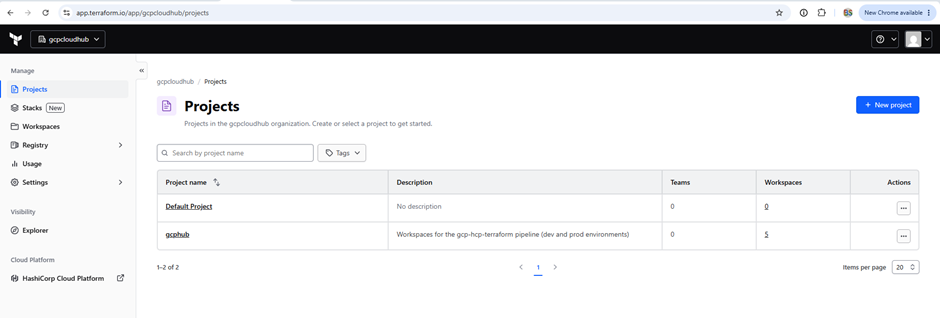
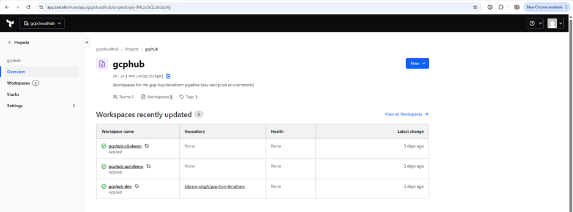
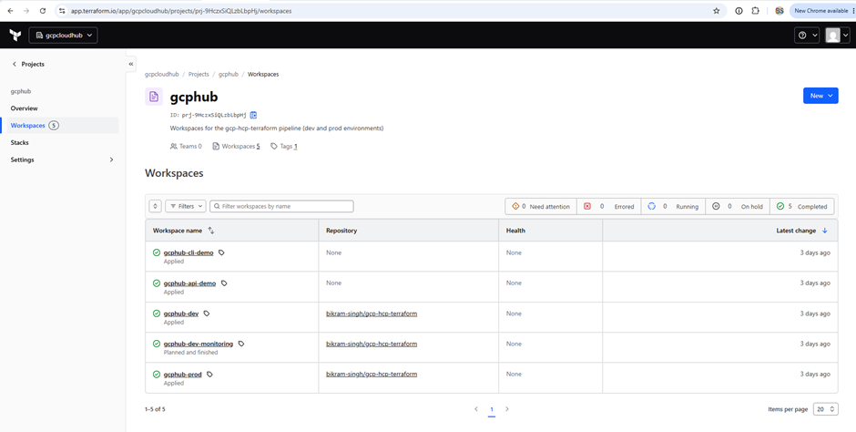

---

### Private module registry — all 3 modules published
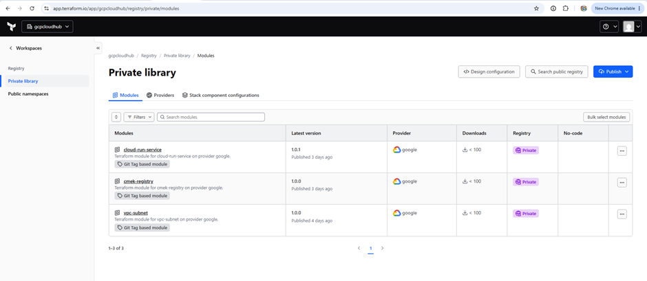

---

### Policy as code — OPA policies and the policy set enforcing them
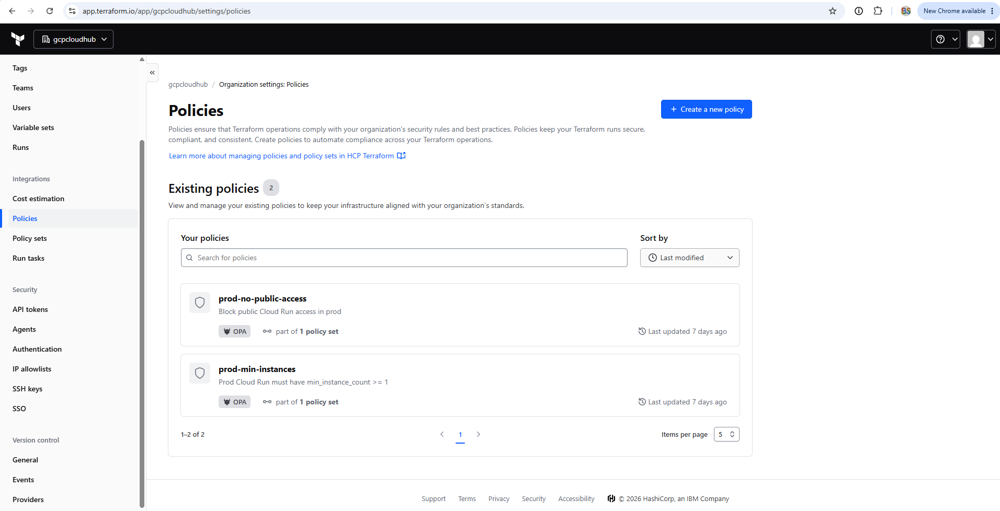
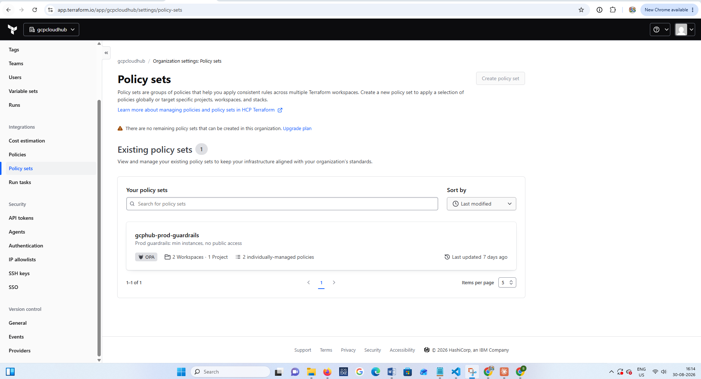

---

### Run Task — the self-built change-freeze guardrail
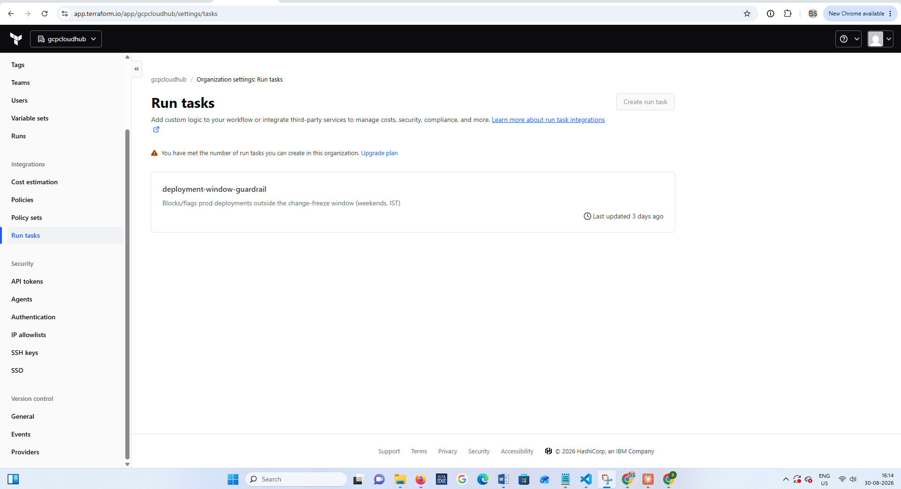

---

### Self-hosted Agent — running via Docker, connected and idle
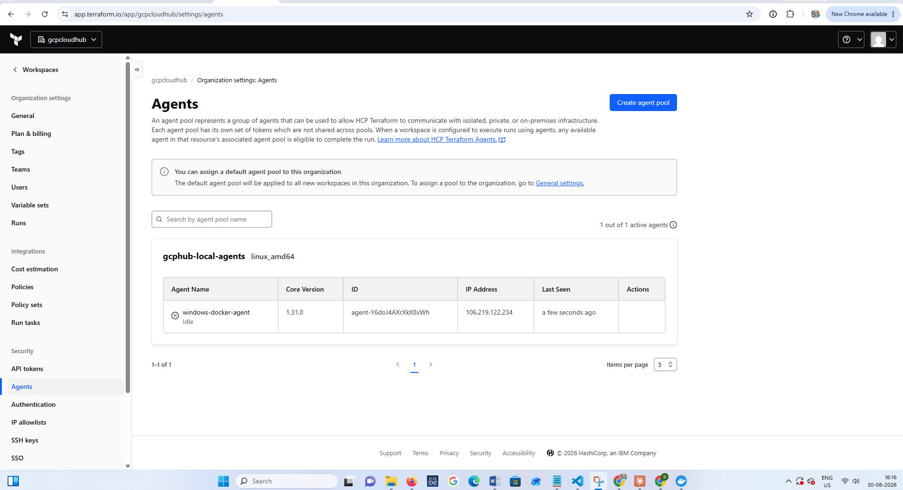

---

### SSO — Google Workspace SAML, enabled and tested
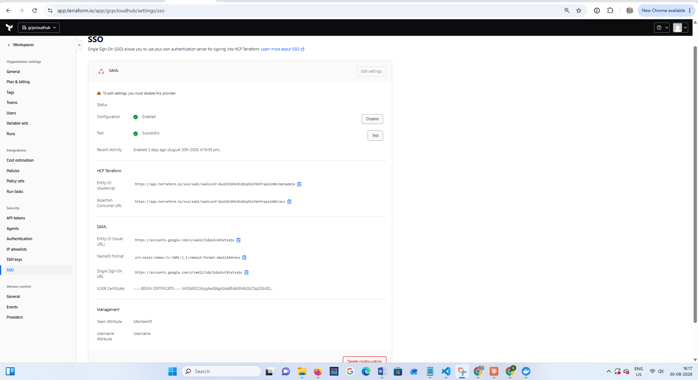

---

### Org access
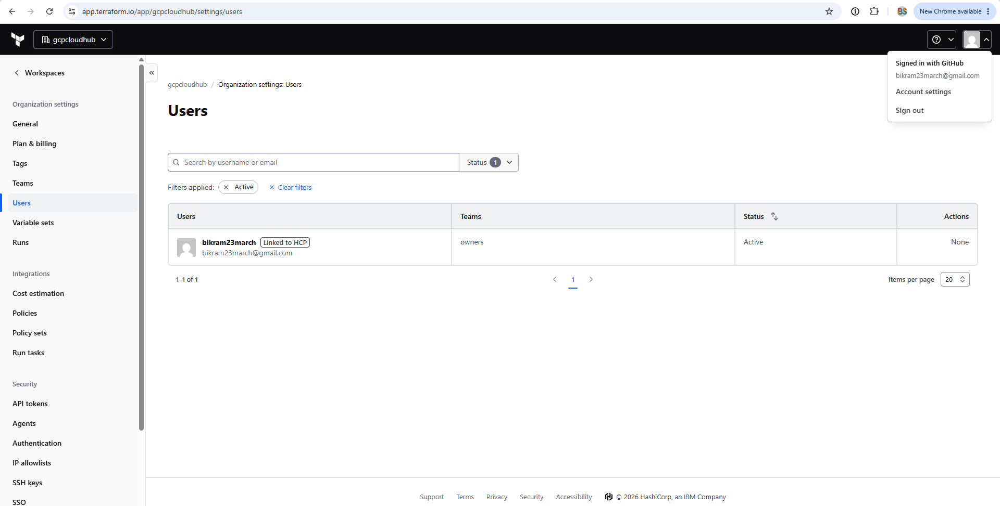

---

### `gcphub-dev` workspace — full detail
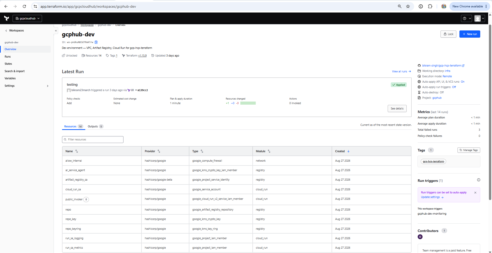
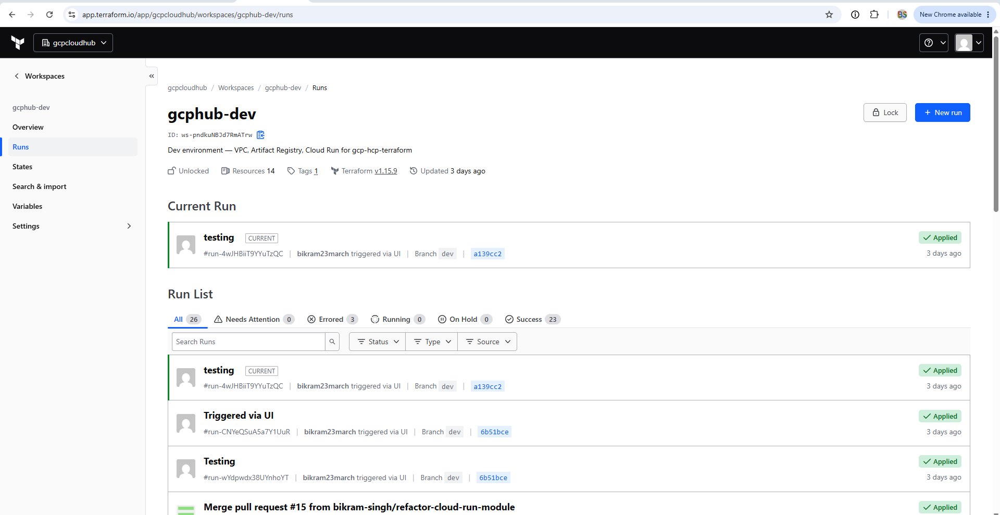
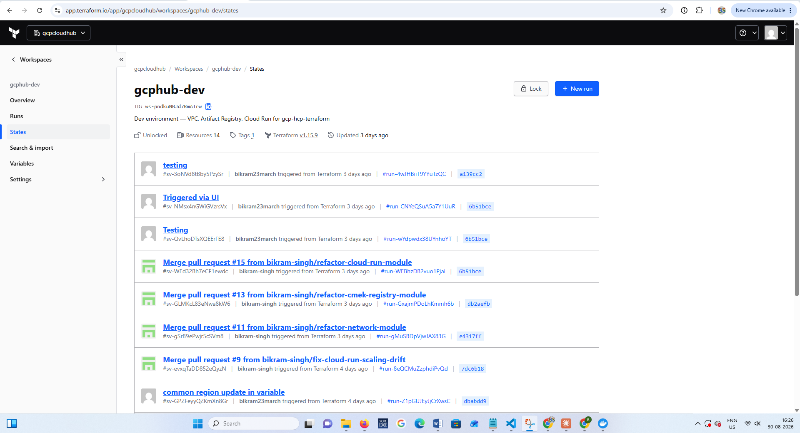
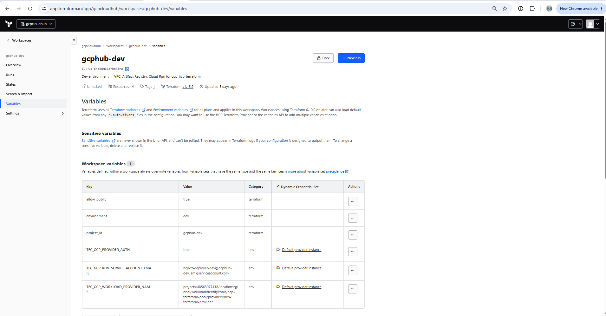
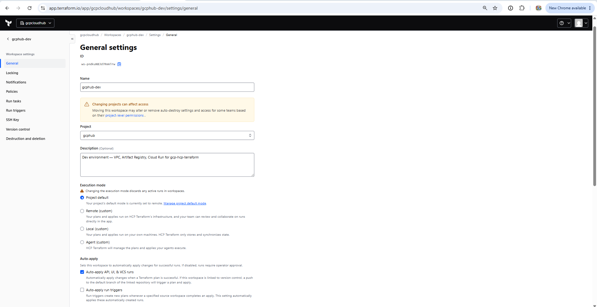
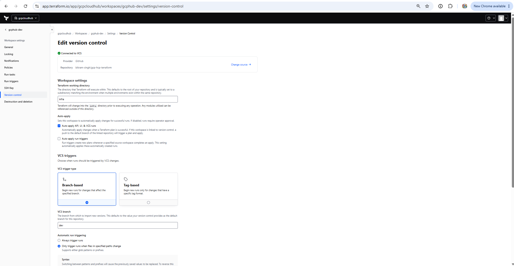
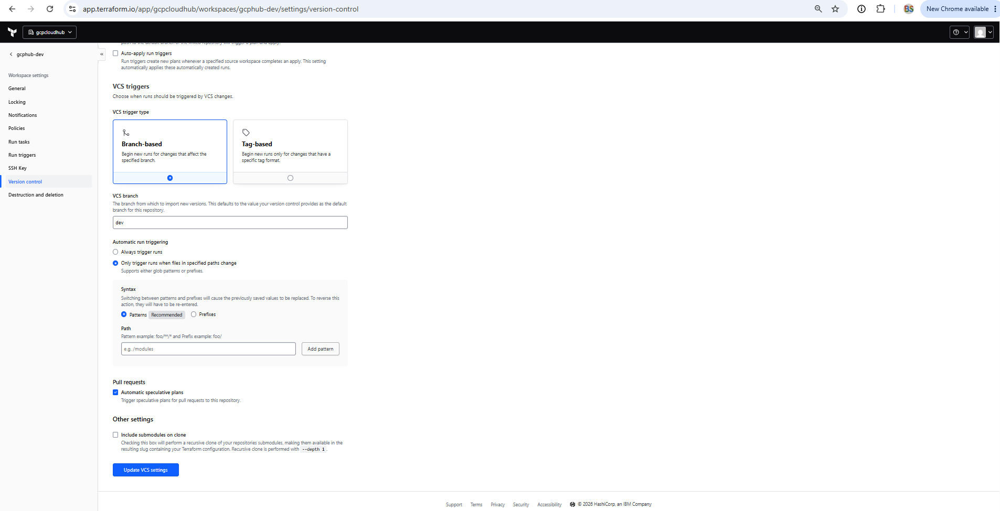

---

### Architecture diagram & branding
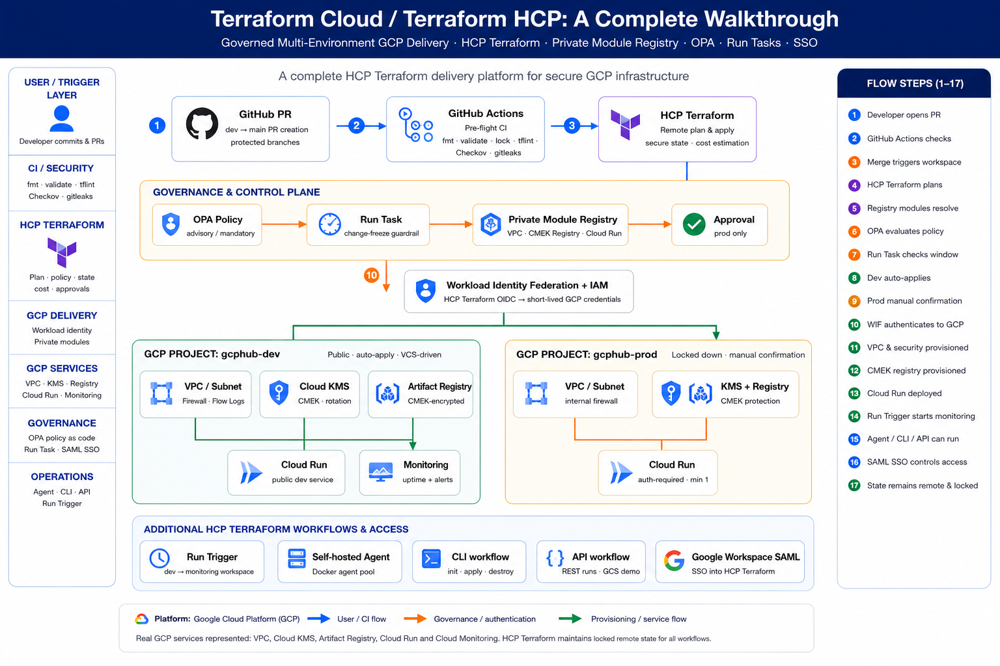
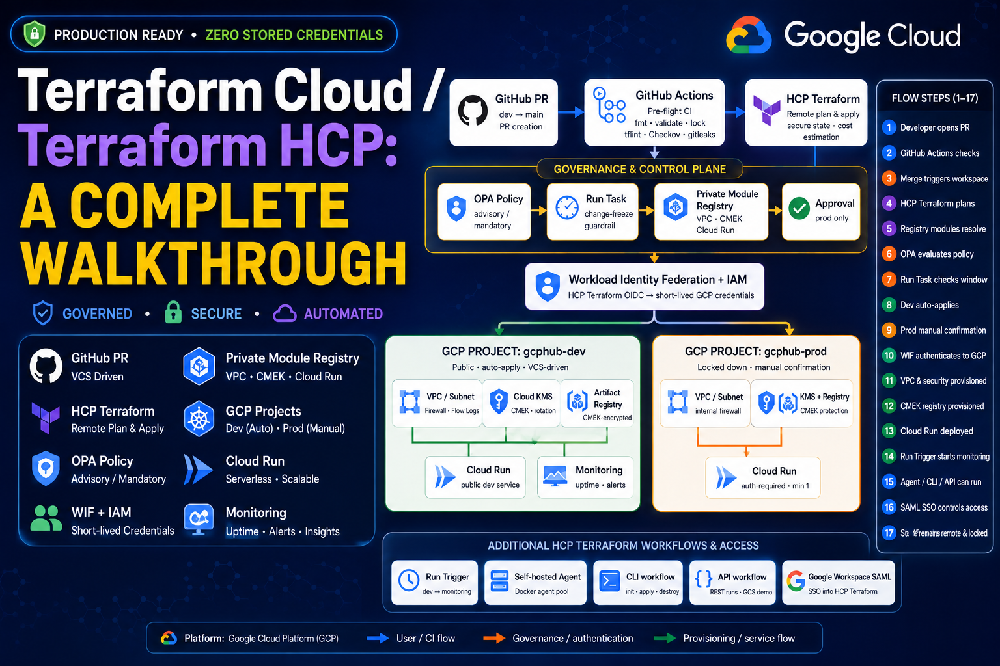
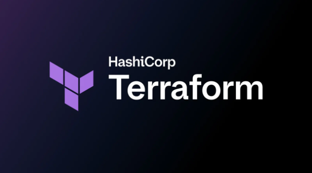

---

## 🔗 Repository

| Repository | Purpose |
|---|---|
| [`gcp-hcp-terraform`](https://github.com/bikram-singh/gcp-hcp-terraform) | This repo — dev/prod pipeline, monitoring, tooling |
| [`terraform-google-vpc-subnet`](https://github.com/bikram-singh/terraform-google-vpc-subnet) | Published module — VPC/subnet/firewall |
| [`terraform-google-cmek-registry`](https://github.com/bikram-singh/terraform-google-cmek-registry) | Published module — CMEK Artifact Registry |
| [`terraform-google-cloud-run-service`](https://github.com/bikram-singh/terraform-google-cloud-run-service) | Published module — Cloud Run + IAM |

---

<div align="center">

**Maintained by Bikram Singh**

*Built with HCP Terraform · GitHub Actions · OPA · Google Cloud Platform*

</div>
